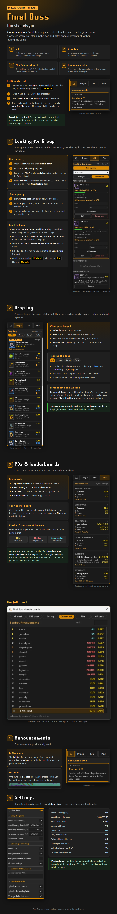

# Final Boss Clan Plugin

An optional RuneLite side panel for the **Final Boss OSRS clan**. It makes it easier to find a group, share drops, see where you stand in the clan and catch announcements, all without leaving the game.

| | Feature | What it does |
|---|---|---|
| 1 | **LFG** | Post a party or apply to one. Posts stay up through logout and world hops. |
| 2 | **Drop log** | Big drops and pets are logged for the clan automatically. Screenshots are optional. |
| 3 | **PBs & leaderboards** | Clan rankings for XP, EHB, collection log, combat achievements, PBs and GP. |
| 4 | **Announcements** | Clan news in the panel, plus a one-line welcome in chat when you log in. |

**Everything is opt-out.** Each upload has its own switch in the plugin settings, and nothing about you is uploaded to the clan until your membership is confirmed.

An illustrated version of this guide is at the [bottom of this page](#illustrated-guide).

## Getting started

1. In RuneLite open the **Plugin Hub** and search for **Final Boss**.
2. Install it and log in on your clan character.
3. Click the Final Boss icon in the RuneLite sidebar.
4. The panel unlocks by itself once it sees you in the clan's **Wise Old Man group (1055)**. No account linking and no Discord login.

If the check fails or you have only just joined the group, press **Retry** on the locked panel.

## 1. Looking for Group

Post a party or join one from inside RuneLite. Anyone who logs in later sees what is open and can apply.

**Host a party**

1. Open the **LFG** tab and press **Host a party**.
2. Pick the activity and party size.
3. Leave it on **ASAP**, or choose **Later** and set a start time up to 7 days ahead.
4. Press **Post now**. For roles, a minimum KC, a loot rule or a description, press **Next (details)** first. Your own role starts as **Any**: you take whichever seat is left, so applicants can pick freely.

**Join a party**

1. Browse **Open parties**; filter by activity if you like.
2. Press **Apply**, choose your role and confirm. Your kill count is filled in from RuneLite's records or the hiscores when available.
3. You get a chat message when the host accepts you, with the world to hop to.

**Good to know**

- Posts survive logout and world hops. They come down when an ASAP party fills, when the host cancels, or 7 days after posting. A scheduled party that fills stays listed as full until its start time has passed.
- Hosts can accept, decline or kick, and can add a member by name if a friend isn't using the plugin. Applicants, added members and hosts get a chat message for each of these.
- A host can run 1 ASAP post and up to 7 scheduled posts at once.
- Scheduled parties remind the host and accepted members in chat 15 minutes before the start.
- When anyone posts a new party, you included, everyone gets a chat line such as "Dopezt created a party of 4 for ToB (ASAP)". Turn it off with **Announce new parties in chat** (or with **Party chat notifications**, which silences every LFG chat line).
- While the board has posts, the clan logo appears in RuneLite's infobox row (where boss timers go) captioned ASAP/total, e.g. "2/6". Hover it for the breakdown by activity. It follows RuneLite's infobox size and position settings; turn it off with **Show party board infobox**.
- Filled parties are kept in a **Formed** list for 7 days.
- From chat: `!lfg` lists open parties, `!lfg tob 4` posts an ASAP party with default settings, and `!lfg help` lists the activity names. Only you see the replies.

## 2. Drop log

A shared feed of the clan's notable loot. It is handy as a backup for clan events if nobody took a picture.

**What gets logged**

- **Valuable:** a single item worth 1,000,000 GP or more (GE price of one, not the stack, so rune and seed stacks don't count).
- **Rare:** a known drop rate of 1 in 250 or rarer, and worth at least 100,000 GP.
- **Pets**, with the pet's name when the client can tell which one it was.
- **Notable items** picked by clan staff, such as untradeable uniques.

Clue scrolls, long and curved bones, champion scrolls and keys are never logged by the value and rarity rules; the clan's notable list can override that. Items on the clan's **ignored** list (runes, seeds, bolts and the like) are never logged and never shown, whatever they are worth.

**Reading the feed**

- Filters: All, Mine, Rare+ and Pets. The tile colour shows how special a drop is.
- **Top drop** pins the biggest drop of the last 24 hours.
- Click any drop for its details and, when it has one, its screenshot.

**Screenshots and Discord**

**Screenshot Drops** is off until you turn it on. When on, it saves a picture of your whole client with each logged drop, and can include RuneLite party member names. You can also paste your own Discord webhook to post your drops to a channel.

NPC kills and reward chests are covered. Keep RuneLite's core **Loot Tracker** plugin enabled for raid and chest loot. Drops are queued on your computer and retried if the connection fails.

To stop logging your drops, untick **Enable Drop Logging**. You can still read the clan feed.

## 3. PBs and leaderboards

Clan stats at a glance, with your own rank under every board.

- **XP gained** and **EHB** this week, from Wise Old Man.
- **Collection log** and **Combat Achievements**.
- **Clan bests:** fastest boss and raid times, by team size.
- **GP this week:** total value of logged drops and the top contributors.

Click any card to open the full board. There you can switch boards, pick a boss for clan bests, or search for a player. Your row is highlighted, and ties share a place.

Personal bests are read from RuneLite's core **Chat Commands** plugin, so keep it enabled. They sync after login and every 30 minutes, and a slower time never replaces a faster one. Collection log and combat achievement totals upload when they change. Uploads are skipped on special worlds such as Leagues and Deadman.

**Combat Achievement helmets**

Members with a high CA tier get a slayer helmet next to their name in chat:

| CA tier | Icon |
|---|---|
| Elite | Tztok slayer helmet |
| Master | Vampyric slayer helmet |
| Grandmaster | Tzkal slayer helmet |

## 4. Announcements

- **In the panel:** the bell tab lists announcements from clan staff, newest first. A red dot on the bell means there is a post you haven't opened.
- **At login:** one `[Final Boss]` line in your chatbox, once per client session.

## Settings and defaults

RuneLite settings, search **Final Boss**, then the cog icon.

| Setting | Default |
|---|---|
| Enable Drop Logging | On |
| Valuable drop threshold | 1,000,000 GP; cannot be set lower |
| Rare drop threshold | 1 in 250; cannot be set more common |
| Rare drop minimum value | 100,000 GP |
| Screenshot Drops | Off |
| Enable LFG | On |
| Party chat notifications | On |
| Party desktop notifications | Off |
| Announce new parties in chat | On |
| Kill count lookups | On |
| Show party board infobox | On |
| Discord Webhook URL | Blank (disabled) |
| Upload personal bests | On |
| Upload collection log & CA | On |
| CA slayer helm chat icons | On |

## External services and privacy

The plugin uses **Wise Old Man** to check clan membership, the clan's **Supabase** backend for the shared features, RuneLite's **hiscore client** for optional kill count lookups, and **Discord** only when you supply a webhook.

- The membership check sends your character name to Wise Old Man.
- Clan uploads begin only after that check passes, and each can be switched off in the settings.
- Depending on what is enabled, shared records include your RSN, logged drops, PB times, collection log and combat achievement totals, and your LFG posts and applications.
- Screenshots include whatever is visible in the client and are stored in a public bucket; enable them only if you want to share that image.
- The Discord webhook URL stays in your local RuneLite configuration.

Player names, achievements and kill counts are reported by members' clients. The plugin is a clan coordination and sharing tool, not independent verification of those claims.

## Building from source

Use **JDK 11 or newer**. The build targets Java 11.

```sh
./gradlew build
./gradlew run
```

On Windows, use `gradlew.bat`. The `run` task launches a RuneLite development client with the plugin loaded; the single class under `src/test` is that launcher. The plugin talks to the clan's backend, which is maintained separately.

## Credits

Item drop rates (`npc_drops.json`) are sourced from the
[OSRS Wiki](https://oldschool.runescape.wiki/) (licensed under
[CC BY-NC-SA 3.0](https://creativecommons.org/licenses/by-nc-sa/3.0/)),
parsed by [Flipping Utilities](https://github.com/Flipping-Utilities/parsed-osrs)
and transformed into the bundled format by the
[Dink](https://github.com/pajlads/DinkPlugin) plugin (BSD 2-Clause), whose
rarity lookup this plugin mirrors.

## License

BSD 2-Clause. See [LICENSE](LICENSE).

## Illustrated guide


